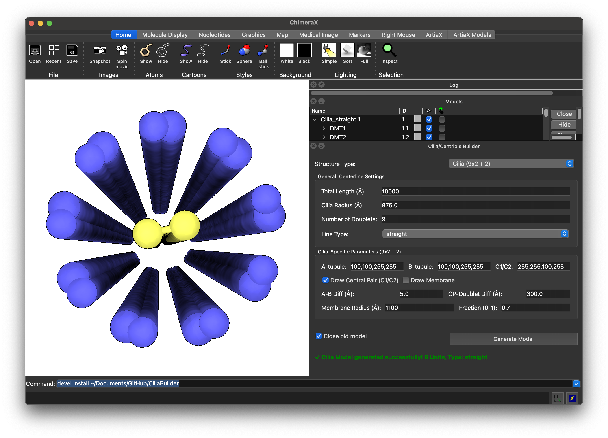

# ChimeraX CiliaBuilder 

[](https://zenodo.org/badge/latestdoi/1115546661)

ChimeraX Tool to build 3D models of cilia and centriole.

## Installation

### Inside ChimeraX

From *ChimeraX > Tools > More Tools* and install *CiliaBuilder*

### By downloading directly from here

Download from here, unzip the file. Then in ChimeraX command line type

```bash
devel install [path_toCiliaBuilder]
```

## Interface usage
Open *Tools > High-order structure > Cilia Builder*

### UI

[](example/CiliaBuilder_screenshot.png)


### Video Tutorial

<iframe width="560" height="315" src="https://www.youtube.com/embed/SJHoQg4RiXQ?si=2MDBfKsDwMy0bMRy" title="YouTube video player" frameborder="0" allow="accelerometer; autoplay; clipboard-write; encrypted-media; gyroscope; picture-in-picture; web-share" referrerpolicy="strict-origin-when-cross-origin" allowfullscreen></iframe>

Other videos

* [Installation](https://youtu.be/OEJJZ-qedoY)
* [Build Cilia](https://youtu.be/SJHoQg4RiXQ)
* [Build Centriole](https://youtu.be/JT0-txlxbJI)
* [Advanced - Build Cilia using 2D template](https://youtu.be/hegsta70xZw)


## Commandline usage

### Simple straight cilia
```bash
ciliabuild length 10000
```

### Curved cilia
```bash
ciliabuild length 10000 type curve curve_radius 10000
```

### Sinusoidal cilia
```bash
ciliabuild length 15000 type sinusoidal sine_frequency 1 sine_amplitude 1000
```

### Cilia with tip
```bash
ciliabuild length 10000 type tip tip_length 4000 
```

### Primary cilia
```bash
ciliabuild length 10000 type primarycilia
```

### Using 2D template file
```bash
ciliabuild length 10000 type 2Dtemplate template_csv
```

### Custom number of doublets
```bash
ciliabuild length 5000 num_doublets 12 cilia_radius 1000
```


### Basic centriole (offset 30 degree)
```bash
centriolebuild length 3000
```

### Centriole with custom angle offset to match with cilia
```bash
centriolebuild length 2000 centriole_angle_offset 0
```

### Custom triplet configuration
```bash
centriolebuild length 5000 num_triplets 12 centriole_radius 1200
```

## Advanced feature

### 2D template from image

Use this [Colab Notebook](https://colab.research.google.com/drive/18XwT8Y2a-_uJxXedFMNic1vg3ZmYLNjr?usp=sharing) to convert your image to 2D template

[Example image](example/cilia_image.png) to test


